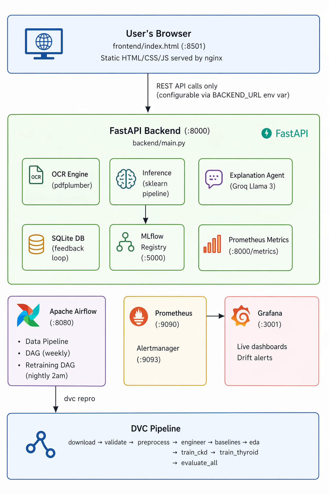
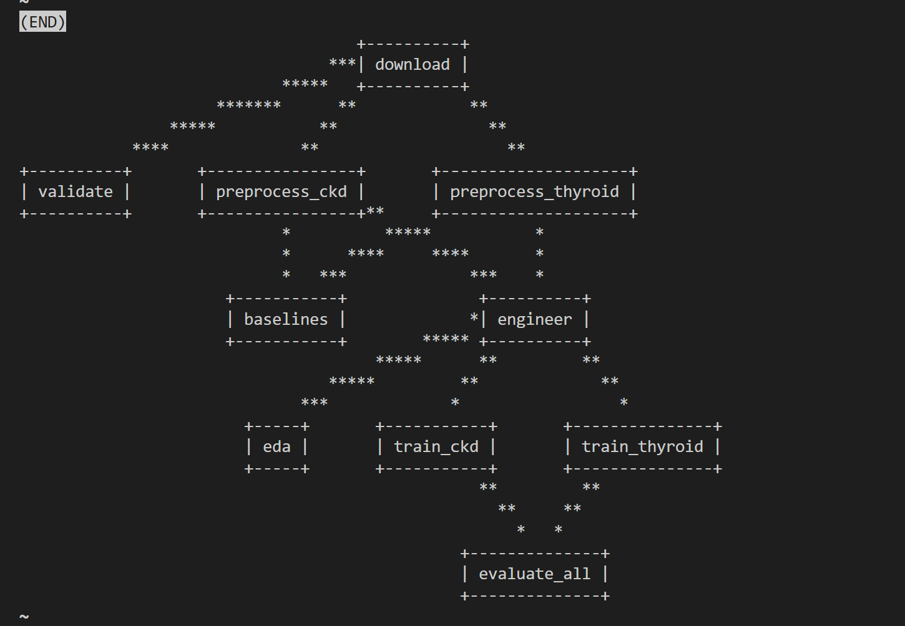
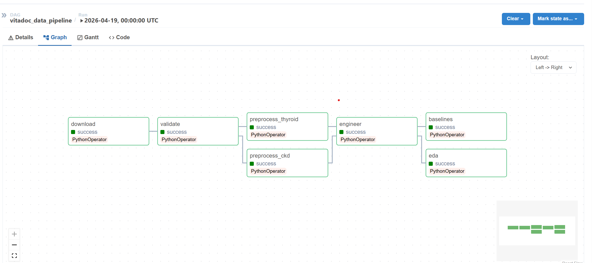
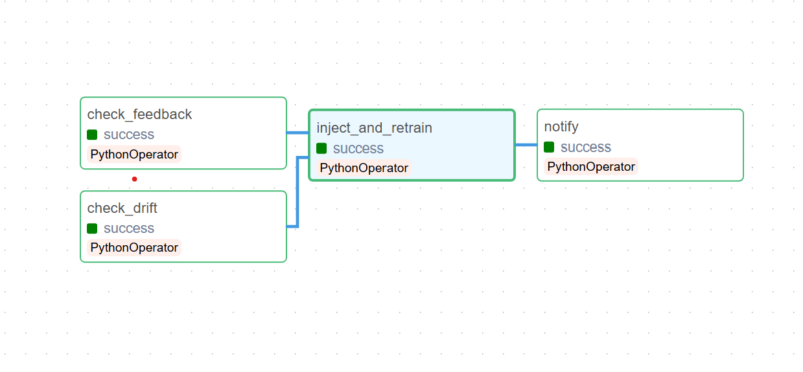

# VitaDoc: Blood Test Analysis Platform
**DA5402 MLOps End-Term Project**

Name: Krithi Shailya
Roll Number: DA25S009

> A fully containerised, end-to-end MLOps platform that extracts lab values from blood test PDFs and classifies health risk across Chronic Kidney Disease (CKD) and Thyroid Dysfunction using reproducible, monitored, and automatically retrained machine learning pipelines.


---

# Table of Contents

1. [Project Documents & Resources](#project-documents--resources)
2. [Gallery](#gallery)
3. [Problem Statement](#1-problem-statement)
4. [Repository Structure](#3-repository-structure)
5. [Prerequisites](#4-prerequisites)
6. [Docker Installation Guide](#docker-installation-guide)

   * [Install Docker](#1-install-docker)
   * [Post-install Setup](#2-post-install-setup-linux-only)
   * [Verify Installation](#3-verify-installation)
   * [Start / Enable Docker](#4-start--enable-docker)
7. [First-Time Setup (Full Cold Start)](#5-first-time-setup-full-cold-start)
8. [DVC Pipeline — Reproducible ML](#6-dvc-pipeline---reproducible-ml)
9. [Airflow DAGs](#7-airflow-dags)
10. [Running the Application Stack](#8-running-the-application-stack)
11. [What You Will See](#9-what-you-will-see)
12. [Subsequent Runs](#10-subsequent-runs)
13. [Monitoring — Prometheus & Grafana](#11-monitoring--prometheus--grafana)
14. [MLflow Experiment Tracking](#12-mlflow-experiment-tracking)
15. [Retraining Pipeline](#13-retraining-pipeline)
16. [CI Pipeline (GitHub Actions)](#14-ci-pipeline-github-actions)
17. [Running Tests](#15-running-tests)
18. [Model Performance](#16-model-performance)
19. [Reproducing a Specific Run](#17-reproducing-a-specific-run)
20. [Scaling & Configuration](#18-scaling--configuration)

---

### Project Documents & Resources

| Document | Link | Description |
|---|---|---|
| Project Report | [`Report.pdf`](Report.pdf) | Full end-term project report |
| Demo Video | [Google Drive Link](#) | End-to-end walkthrough video |
| Architecture Diagram | [`gallery/detailedarchitecture.png`](gallery/detailedarchitecture.png) | Full system architecture |
| High-Level Design | [`docs/hld.md`](docs/hld.md) | Architecture, design paradigm, success metrics |
| Low-Level Design | [`docs/lld.md`](docs/lld.md) | All API endpoints with I/O schemas |
| Test Plan | [`docs/test_plan.md`](docs/test_plan.md) | Test cases, acceptance criteria, results |
| User Manual | [`docs/user_manual.md`](docs/user_manual.md) | Non-technical guide to using the app |
| Model Comparison | [`reports/comparison.md`](reports/comparison.md) | Final model metrics and MLflow run IDs |
| AI Disclosure | [`AI_DISCLOSURE.md`](AI_DISCLOSURE.md) | AI tool usage declaration |

---

### Gallery

| | |
|---|---|
|  |  |
| **System Architecture** - Full block diagram of all services and how they connect | **DVC DAG** - Full dependency graph from download through evaluate_all|
|  |  |
| **Airflow Data Pipeline DAG** - Weekly pipeline with parallel preprocess tasks | **Retraining DAG** - Nightly 2am drift and feedback checks |

---

## 1. Problem Statement

Blood test reports are issued routinely but rarely understood by patients. VitaDoc bridges this medical literacy gap by:

- Automatically extracting lab values from an uploaded blood test PDF (via `pdfplumber` OCR/regex)
- Classifying health risk for **Chronic Kidney Disease** and **Thyroid Dysfunction**
- Generating plain-English explanations of each classification via the Groq LLaMA 3 API
- Providing a monitored, retrain-capable MLOps platform around the entire lifecycle

Both conditions were chosen because their diagnosis depends on **multiple correlated lab values** rather than a single threshold - making them genuinely interesting classification problems with well-documented public datasets and measurable drift surfaces.

---

## 3. Repository Structure

```
vitadoc/
├── backend/
│   ├── main.py                  # FastAPI app — inference, OCR, feedback, metrics
│   └── reference_ranges.json    # Clinical reference ranges for all lab values
├── dags/
│   ├── vitadoc_pipeline.py      # Airflow: weekly data pipeline DAG
│   └── vitadoc_retraining.py    # Airflow: nightly retraining DAG
├── src/
│   ├── features/
│   │   ├── download_data.py     # Stage 1 — download raw CSVs
│   │   ├── validate.py          # Stage 2 — schema & missing-value checks
│   │   ├── preprocess.py        # Stage 3 — clean, impute, encode, baseline stats
│   │   ├── engineer.py          # Stage 4 — feature engineering (kidney_stress, tsh_t3_ratio)
│   │   └── eda.py               # Stage 5 — EDA plots saved to reports/eda/
│   └── models/
│       ├── train_ckd.py         # Stage 6a — XGBoost + RF grid search, MLflow logging
│       ├── train_thyroid.py     # Stage 6b — XGBoost + RF with SMOTE, MLflow logging
│       └── evaluate_all.py      # Stage 7 — cross-model evaluation, reports/comparison.md
├── tests/
│   ├── test_validate.py
│   ├── test_preprocess.py
│   ├── test_engineer.py
│   ├── test_models.py
│   ├── test_backend.py
│   ├── test_frontend.py
│   └── test_smoke.py            # Smoke tests (require running stack)
├── frontend/
│   └── index.html               # Single-page app served by nginx
├── grafana/
│   └── provisioning/            # Auto-provisioned datasource + dashboard
├── data/
│   ├── baseline_stats.json      # Feature mean/variance for drift detection
│   └── raw/                     # gitignored — populated by DVC
├── models/                      # gitignored — populated by DVC
├── reports/
│   ├── ckd_metrics.json
│   ├── thyroid_metrics.json
│   ├── comparison.md
│   └── eda/                     # EDA plots (class distributions, correlations, etc.)
├── docs/
│   ├── hld.md                   # High-level design document
│   ├── lld.md                   # Low-level design + API spec
│   ├── test_plan.md             # Test plan and acceptance criteria
│   └── user_manual.md           # Non-technical user guide
├── gallery/                     # Architecture diagrams and screenshots
├── dvc.yaml                     # DVC pipeline definition
├── dvc.lock                     # Locked pipeline hashes (reproducibility)
├── params.yaml                  # All model hyperparameters (single source of truth)
├── MLproject                    # MLflow Projects entry points
├── conda.yaml                   # Conda environment for MLflow Projects
├── docker-compose.yml           # Main stack
├── docker-compose.airflow.yml   # Airflow stack
├── docker-compose.mlflow.yml    # Standalone MLflow (dev)
├── Dockerfile.backend
├── Dockerfile.frontend
├── Dockerfile.airflow
├── prometheus.yml               # Prometheus scrape config
├── alertmanager.yml             # Alertmanager routing
├── alertmanager_rules.yml       # Alert rules (drift, error rate > 5%)
└── .github/workflows/ci.yml     # GitHub Actions CI
```

---

## 4. Prerequisites

| Tool | Version | Purpose |
|---|---|---|
| Docker | ≥ 24 | Container runtime |
| Docker Compose | ≥ 2.20 | Multi-service orchestration |
| Python | 3.10 | DVC + local script runs |
| DVC | ≥ 3.0 | Pipeline & data versioning |
| Git | ≥ 2.40 | Source control |
| (Optional) Groq API key | — | LLM explanations |

```bash
# Verify your setup
docker --version
docker compose version
python --version
dvc --version
git --version
```

Install DVC if missing:

```bash
pip install dvc
```
Here’s a clean, minimal **README-style guide** you can drop into your project.

---

### Docker Installation Guide

### 1. Install Docker

**Linux (Ubuntu/Debian)**

```bash
# Update packages
sudo apt update

# Install dependencies
sudo apt install -y ca-certificates curl gnupg

# Add Docker’s official GPG key
sudo install -m 0755 -d /etc/apt/keyrings
curl -fsSL https://download.docker.com/linux/ubuntu/gpg | \
  sudo gpg --dearmor -o /etc/apt/keyrings/docker.gpg

# Add repository
echo \
  "deb [arch=$(dpkg --print-architecture) signed-by=/etc/apt/keyrings/docker.gpg] \
  https://download.docker.com/linux/ubuntu $(. /etc/os-release && echo $VERSION_CODENAME) stable" | \
  sudo tee /etc/apt/sources.list.d/docker.list > /dev/null

# Install Docker
sudo apt update
sudo apt install -y docker-ce docker-ce-cli containerd.io docker-buildx-plugin docker-compose-plugin
```

---

**macOS**

1. Download **Docker Desktop**
2. Install the `.dmg`
3. Launch Docker

[https://www.docker.com/products/docker-desktop](https://www.docker.com/products/docker-desktop)

---

**Windows**

1. Install **Docker Desktop**
2. Enable **WSL2**
3. Restart system

👉 [https://www.docker.com/products/docker-desktop](https://www.docker.com/products/docker-desktop)

---

### 2. Post-install Setup (Linux only)

Run Docker without `sudo`:

```bash
sudo usermod -aG docker $USER
newgrp docker
```

---

### 3. Verify Installation

```bash
docker --version
docker compose version
```

Test with:

```bash
docker run hello-world
```

---

### 4. Start / Enable Docker

```bash
sudo systemctl start docker
sudo systemctl enable docker
```
---

## 5. First-Time Setup (Full Cold Start)

These steps assume a completely fresh clone with no cached data, no models, and no running containers.

### 5.1 Clone the repository

```bash
git clone <repo-url>
cd DA5402-MLOps-Endterm-Vitadoc-main
```

### 5.2 Create environment file

```bash
cp .env.example .env  # or create manually
```

Minimum `.env`:

```env
GROQ_API_KEY=your_key_here   # Optional — explanations will be skipped if absent
```

### 5.3 Run the DVC pipeline (builds all data + models)

This is the **single command** that reproduces the entire ML pipeline from raw data download through to trained, registered models.

```bash
dvc repro
```

DVC will run the following stages in dependency order:

```
download  →  validate  →  preprocess_ckd  ─┬─  engineer  →  baselines  →  eda
                       →  preprocess_thyroid ┘            →  train_ckd
                                                          →  train_thyroid
                                                          →  evaluate_all
```

Each stage only re-runs if its inputs (data or code) have changed: unchanged stages are skipped with `[cached]`. On a first run all stages execute; subsequent runs are incremental.

Expected output per stage:

| Stage | What runs | Output |
|---|---|---|
| `download` | Downloads CKD + Thyroid CSVs from UCI | `data/raw/ckd.csv`, `data/raw/thyroid.csv` |
| `validate` | Schema checks, missing value counts | Logs only |
| `preprocess_ckd` | Imputation, encoding, cleaning | `data/processed/ckd_clean.csv` |
| `preprocess_thyroid` | Imputation, encoding, cleaning | `data/processed/thyroid_clean.csv` |
| `baselines` | Computes mean/variance per feature | `data/baseline_stats.json` |
| `engineer` | Adds `kidney_stress`, `tsh_t3_ratio` | `data/processed/ckd_engineered.csv`, `data/processed/thyroid_engineered.csv` |
| `eda` | Generates correlation/distribution plots | `reports/eda/*.png` |
| `train_ckd` | Grid search XGBoost + RF, MLflow logs | `models/ckd_model.pkl`, `reports/ckd_metrics.json` |
| `train_thyroid` | Grid search XGBoost + RF + SMOTE, MLflow logs | `models/thyroid_model.pkl`, `reports/thyroid_metrics.json` |
| `evaluate_all` | Cross-model comparison | `reports/comparison.md` |

### 5.4 Register models in MLflow

After training, the scripts auto-register models. To promote the best runs to `@champion` (required for the backend to load them):

```bash
# Start MLflow first
docker compose -f docker-compose.mlflow.yml up -d
```

The `<version>` numbers are shown in the MLflow UI under **Models → VitaDoc-CKD / VitaDoc-Thyroid**.

### 5.5 Start the full application stack

```bash
docker compose up --build -d
```

This starts all services: backend, MLflow, MLflow model servers (CKD :5001, Thyroid :5002), Prometheus, Alertmanager, Grafana, and frontend.

### 5.6 Start Airflow (separate compose file)

```bash
docker compose -f docker-compose.airflow.yml up -d
```

On first run, Airflow initialises its database. Wait ~60 seconds then open `http://localhost:8080` (user: `airflow`, password: `airflow`).

---

## 6. DVC Pipeline - Reproducible ML

### What DVC gives you

Every stage in `dvc.yaml` is hashed. `dvc.lock` records the exact MD5 of every input file and output file after each successful run. This means:

- **Any code or data change** is detected automatically - only affected downstream stages re-run.
- **Any collaborator** who runs `dvc repro` on the same commit gets byte-identical outputs.
- **Every experiment** can be reproduced from a Git commit hash alone.

### Visualising the DAG

```bash
# Text DAG in terminal (as shown in dvcdag.png)
dvc dag
```

The DVC DAG (see [`gallery/dvcdag.png`](gallery/dvcdag.png)) shows the full dependency graph from `download` through `evaluate_all`, including the parallel `preprocess_ckd` / `preprocess_thyroid` branches that merge at `engineer`.

### Running individual stages

```bash
# Re-run a single stage (and all downstream dependents)
dvc repro train_ckd

# Force re-run a stage even if inputs haven't changed
dvc repro --force download

# Check what would run without running it
dvc status
```

### Checking pipeline status

```bash
# Show which stages are stale vs cached
dvc status

# Show parameter diff vs last run
dvc params diff

# Show metric diff vs last run
dvc metrics diff
```

### Hyperparameter changes

All hyperparameters live in `params.yaml`. To run a different model configuration:

```bash
# Edit params.yaml — e.g. change active_models from "both" to "xgb"
# Then:
dvc repro train_ckd
```

DVC detects the param change and re-runs only the affected stages.

### Using MLflow Projects for isolated training

```bash
mlflow run . -e train_ckd -P model=xgb
mlflow run . -e train_thyroid -P model=rf
mlflow run . -e evaluate
```

This uses the `conda.yaml` environment to guarantee identical Python environments across machines.

---

## 7. Airflow DAGs

The Airflow UI is at `http://localhost:8080`.

### 7.1 Data Pipeline DAG (`vitadoc_data_pipeline`)

Runs **weekly**. Orchestrates the DVC pipeline stages as individual Airflow tasks using PythonOperator.

The DAG graph (see [`gallery/dagpipeline.png`](gallery/dagpipeline.png)) shows:

```
download  →  validate  →  preprocess_thyroid ─┬─  engineer  →  baselines
                       →  preprocess_ckd     ─┘             →  eda
```

Key design decisions:
- All resource-intensive tasks run under a `vitadoc_pool` (3 slots), preventing CPU oversubscription.
- `preprocess_ckd` and `preprocess_thyroid` run **in parallel** (1 slot each) after `validate`.
- `engineer` takes 2 slots, signalling it processes both datasets and blocks both preprocess slots.
- `baselines` and `eda` are read-only aggregations and run outside the pool.

To trigger manually:

```bash
# From Airflow UI: Trigger DAG → vitadoc_data_pipeline
# Or via CLI inside the Airflow container:
docker exec -it <airflow-container> airflow dags trigger vitadoc_data_pipeline
```

What to look for in the Airflow UI:
- Green squares = success, Red = failed, Yellow = running.
- Click any task → **Logs** to see stdout/stderr from that stage.
- **Gantt** tab shows parallel execution of the preprocess tasks.
- **Graph** tab matches the `dagpipeline.png` screenshot exactly.

### 7.2 Retraining DAG (`vitadoc_retraining`)

Runs **nightly at 2am**. Checks two independent conditions before triggering retraining:

```
check_feedback ─┬─  inject_and_retrain  →  notify
check_drift    ─┘
```

The DAG graph is shown in [`gallery/retrainingpipeline.png`](gallery/retrainingpipeline.png).

**Drift check (`check_drift`):** Computes rolling mean of key features (`sc`, `TSH`, `hemo`) from the last 100 predictions stored in SQLite. Compares against `data/baseline_stats.json`. If any feature deviates by more than 2 standard deviations, drift is flagged.

**Feedback check (`check_feedback`):** Reads the SQLite feedback table. If there are ≥ 20 unused corrections **and** the correction rate exceeds 15%, feedback is flagged.

**`inject_and_retrain`:** If either condition triggers, this task:
1. Appends corrected samples to `data/raw/ckd.csv` / `data/raw/thyroid.csv`
2. Marks those rows as `used_in_training = 1` in SQLite
3. Runs `dvc repro` — DVC detects the CSV hash changed and re-runs only the affected stages

The new model version appears in MLflow registry automatically because training scripts call `mlflow.register_model`.

---

## 8. Running the Application Stack

### Full stack (after first-time setup)

```bash
docker compose up -d
docker compose -f docker-compose.airflow.yml up -d
```

### Verify all services are healthy

```bash
docker compose ps
```

Expected state — all services `running (healthy)` or `running`:

| Service | Port | Purpose |
|---|---|---|
| `backend` | 8000 | FastAPI inference API |
| `mlflow` | 5000 | Experiment tracking + model registry |
| `mlflow-serve-ckd` | 5001 | CKD model server |
| `mlflow-serve-thyroid` | 5002 | Thyroid model server |
| `prometheus` | 9090 | Metrics collection |
| `alertmanager` | 9093 | Alert routing |
| `grafana` | 3001 | Dashboards |
| `frontend` | 8501 | Web UI |
| Airflow webserver | 8080 | DAG management |

### Quick health check

```bash
curl http://localhost:8000/health
# {"status":"ok"}

curl http://localhost:8000/ready
# {"status":"ready","models_loaded":["ckd","thyroid"],"model_count":2}
```

If `model_count` is less than 2, the backend is still loading models from the MLflow registry. Wait ~15 seconds and retry.

### Stop everything

```bash
docker compose down
docker compose -f docker-compose.airflow.yml down
```

### Stop but keep volumes (MLflow runs, Grafana dashboards)

```bash
docker compose down --volumes=false
```

---

## 9. What You Will See

### Frontend (`http://localhost:8501`)

The single-page application has two input modes:

**PDF Upload mode:** Upload a blood test PDF. The backend extracts lab values using `pdfplumber` regex patterns matched against `reference_ranges.json`. Extracted values are shown before the analysis runs, so you can see exactly what was parsed.

**Manual Entry mode:** Enter lab values directly — useful for testing specific combinations or when OCR extraction fails.

After submission:

- **CKD result:** `ckd` / `not_ckd` with a confidence score
- **Thyroid result:** `hypothyroid` / `hyperthyroid` / `negative` with confidence
- **Explanation:** Plain-English LLaMA 3 explanation of what each result means and which values drove the classification (requires Groq API key)
- **Reference ranges:** Each extracted value shown against its normal range with colour coding

**Feedback button:** Submit a correction if the classification is wrong. This feeds the SQLite feedback loop used by the nightly retraining DAG.

### MLflow UI (`http://localhost:5000`)

- **Experiments → VitaDoc-CKD:** All XGBoost and RF training runs with accuracy, AUC, hyperparameters, and the `ckd_model.pkl` artifact
- **Experiments → VitaDoc-Thyroid:** All Thyroid runs with macro-F1 and the `thyroid_model.pkl` artifact
- **Models → VitaDoc-CKD / VitaDoc-Thyroid:** Registered versions — the `@champion` alias is what the backend loads at startup

Every training run logs:
- Hyperparameters (n_estimators, max_depth, learning_rate)
- Metrics (accuracy, AUC/macro-F1, per-class F1)
- The trained model artifact
- Dataset version tag (e.g., `v7-eda`)
- Git commit hash (via `mlflow.set_tag`)

### Grafana (`http://localhost:3001`, login: `admin` / `vitadoc`)

The pre-provisioned **VitaDoc dashboard** shows:

- `vitadoc_predictions_total` — prediction count by condition and class (rate over time)
- `vitadoc_inference_seconds` — inference latency histogram (p50, p95, p99)
- `vitadoc_requests_total` — total API requests
- `vitadoc_drift_score` — rolling Z-score for `sc`, `TSH`, `hemo` features
- `vitadoc_feedback_corrections_total` — user correction count

**Alerts** are pre-configured:
- `HighErrorRate` — fires if `vitadoc_errors_total` rate exceeds 5%
- `DriftDetected` — fires if any feature drift score exceeds 2.0 std deviations
- Routes to Alertmanager → configurable email/Slack webhook in `alertmanager.yml`

### Airflow (`http://localhost:8080`, login: `airflow` / `airflow`)

- **DAGs** tab shows both `vitadoc_data_pipeline` and `vitadoc_retraining`
- Green/red circles on the DAG list show last run status
- Click into a DAG → **Graph** view matches the screenshots in [`gallery/dagpipeline.png`](gallery/dagpipeline.png) and [`gallery/retrainingpipeline.png`](gallery/retrainingpipeline.png)
- **Gantt** view shows the parallel preprocess tasks running simultaneously
- **Logs** on any task show the exact subprocess stdout — identical to running the script manually

---

## 10. Subsequent Runs

After the first-time setup, day-to-day usage is much simpler.

### Restart the stack (e.g., after machine reboot)

```bash
docker compose up -d
docker compose -f docker-compose.airflow.yml up -d
```

MLflow volumes persist trained models and run history. Grafana volumes persist dashboard customisations.

### Re-run the ML pipeline after a code change

```bash
# DVC checks hashes — only changed stages run
dvc repro
```

### Re-run the pipeline after a data change

If `data/raw/ckd.csv` or `data/raw/thyroid.csv` is updated (e.g., by the retraining DAG), DVC detects the MD5 change and re-runs all downstream stages automatically on the next `dvc repro`.

### Experiment with different hyperparameters

Edit `params.yaml` — for example to test only XGBoost on CKD:

```yaml
ckd:
  active_models: "xgb"
  xgb:
    max_combinations: 27
    search_grid:
      n_estimators: [200, 300, 500]
      max_depth: [4, 6, 8]
      learning_rate: [0.05, 0.1]
```

Then:

```bash
dvc repro train_ckd
```

The new run appears in MLflow. Compare with previous runs using:

```bash
dvc metrics diff
```

### Roll back to a previous model version

```bash
git checkout <commit-hash>
dvc checkout          # restores data/models to that commit's state
dvc repro             # optional — re-verify the pipeline
```

---

## 11. Monitoring — Prometheus & Grafana

### Raw metrics endpoint

```bash
curl http://localhost:8000/metrics
```

Exposes all Prometheus metrics in text format. Key custom metrics:

| Metric | Type | Labels | Description |
|---|---|---|---|
| `vitadoc_predictions_total` | Counter | `condition`, `predicted_class` | Prediction count |
| `vitadoc_inference_seconds` | Histogram | — | Per-request inference time |
| `vitadoc_requests_total` | Counter | `method`, `endpoint`, `status` | HTTP request count |
| `vitadoc_drift_score` | Gauge | `feature` | Rolling Z-score vs baseline |
| `vitadoc_feedback_corrections_total` | Counter | `condition` | User-submitted corrections |
| `vitadoc_errors_total` | Counter | `stage` | Errors by pipeline stage |

### Querying in Prometheus (`http://localhost:9090`)

```promql
# Prediction rate (per minute)
rate(vitadoc_predictions_total[1m])

# 95th percentile inference latency
histogram_quantile(0.95, vitadoc_inference_seconds_bucket)

# Drift score for creatinine (sc)
vitadoc_drift_score{feature="sc"}

# Error rate
rate(vitadoc_errors_total[5m])
```

### Grafana

Navigate to `http://localhost:3001`. The **VitaDoc** dashboard is pre-provisioned from `grafana/provisioning/dashboards/vitadoc.json` — no manual setup required.

To add a new panel: click **Edit Dashboard** → **Add Panel** → use any of the PromQL queries above.

---

## 12. MLflow Experiment Tracking

### Experiments

Two experiments are tracked:

- **VitaDoc-CKD** — Binary classification (ckd / not_ckd)
- **VitaDoc-Thyroid** — Three-class classification (hypothyroid / hyperthyroid / negative)

### What is logged per run

```python
# Automatically logged by train_ckd.py / train_thyroid.py:
mlflow.log_params({"n_estimators": 100, "max_depth": 3, "learning_rate": 0.05})
mlflow.log_metrics({"accuracy": 1.0, "auc": 1.0, "macro_f1": 1.0})
mlflow.log_artifact("models/ckd_model.pkl")
mlflow.set_tag("dataset_version", "v7-eda")
mlflow.set_tag("git_commit", subprocess.check_output(["git", "rev-parse", "HEAD"]))
mlflow.sklearn.log_model(model, "model")
mlflow.register_model(...)
```

Beyond autolog, each training script manually logs per-class F1 scores, confusion matrix values, and the SMOTE resampling ratio (thyroid only).

### Comparing runs from the CLI

```bash
mlflow runs list --experiment-name VitaDoc-CKD
mlflow runs get --run-id e752cad7210a4ea69aab0d1ee71651df
```

### Model registry

```bash
# List all registered model versions
mlflow models list

# Get details of the @champion version
mlflow models get VitaDoc-CKD@champion
```

---

## 13. Retraining Pipeline

The nightly retraining DAG (`vitadoc_retraining`, runs at 2am) is fully automatic. Here is what each task does and how to verify it ran:

### `check_feedback`

Queries `logs/vitadoc.db` (table: `predictions`, `feedback`). Flags retraining if:
- ≥ 20 corrections exist with `used_in_training = 0`
- Correction rate > 15% of total predictions

### `check_drift`

Reads `data/baseline_stats.json` (computed during `baselines` stage). Computes rolling mean of `sc`, `TSH`, `hemo` from last 100 predictions. Flags if Z-score > 2.0 for any feature.

### `inject_and_retrain`

Only runs if either check triggers. Appends new training samples, marks them used, runs `dvc repro`. The new model version is registered in MLflow automatically.

### `notify`

Logs retraining outcome. In production this would POST to a Slack webhook (configurable in `alertmanager.yml`).

### To simulate a drift trigger manually

```bash
# Inside the Airflow container, trigger just the inject_and_retrain task:
docker exec -it <airflow-container> \
  airflow tasks run vitadoc_retraining inject_and_retrain <date>
```

---

## 14. CI Pipeline (GitHub Actions)

Three jobs run on every push and pull request to `main`:

### `test` — Unit tests

Installs dependencies and runs:

```bash
pytest tests/ -v -m "not smoke and not integration" --html=reports/test_report.html
```

Uploads `test_report.html` as a build artifact.

### `lint` — Code style

Runs `black --check` across `src/`, `backend/`, `tests/`, `dags/`. Reports formatting issues but does not block the build (`continue-on-error: true`).

### `dvc-validate` — Pipeline integrity

```bash
dvc dag --dot > /dev/null   # Validates dvc.yaml parses correctly
dvc params diff --all        # Checks params.yaml is well-formed
```

This ensures the DVC pipeline definition is always valid on every commit, even without data.

The test report HTML is available under **Actions → <run> → Artifacts → test-report**.

---

## 15. Running Tests

### Unit tests (no services required)

```bash
pip install pytest pytest-html pytest-metadata
pip install -r requirements.backend.txt

pytest tests/ -v -m "not smoke and not integration"
```

### Smoke tests (require running stack)

```bash
# Ensure docker compose up -d is running first
pytest tests/test_smoke.py -v
```

Smoke tests verify:
- `GET /health` returns 200
- `GET /ready` returns both models loaded
- `POST /analyse/manual` with synthetic lab values returns a valid prediction
- End-to-end latency is under 2s

### Full test run with report

```bash
pytest tests/ -v --html=reports/test_report.html --self-contained-html
```

Open `reports/test_report.html` in a browser.

---

## 16. Model Performance

Current best runs from `reports/comparison.md`:

| Model | Best Run | Accuracy | AUC / Macro-F1 | Status |
|---|---|---|---|---|
| CKD | `ckd_xgb_ne100_d3_lr0.05` | 1.0000 | AUC: 1.0000 | ✅ PASS |
| Thyroid | `thy_rf_smote_ne100_d5` | 0.8889 | Macro-F1: 0.6980 | ✅ PASS |

**Acceptance thresholds:** CKD AUC ≥ 0.95, Thyroid Macro-F1 ≥ 0.50. Both models pass.

**MLflow Run IDs (for exact reproducibility):**

| Model | Run ID |
|---|---|
| CKD | `e752cad7210a4ea69aab0d1ee71651df` |
| Thyroid | `fa060684fbd54bb3a052613594a2ae54` |

---

## 17. Reproducing a Specific Run

Every experiment is reproducible from a Git commit hash and an MLflow run ID.

```bash
# 1. Check out the exact code state
git checkout <commit-hash>

# 2. Restore the exact data/model state
dvc checkout

# 3. Verify the pipeline is unchanged
dvc status   # should show: Data and pipelines are up to date.

# 4. Inspect the exact MLflow run
mlflow runs get --run-id <runid>

# 5. Re-run training with the same params (will produce identical artifacts)
dvc repro train_ckd
```

To reproduce the full pipeline from scratch on a new machine:

```bash
git clone <repo-url>
cd vitadoc
pip install dvc
dvc repro
# That's it.
```

---

## 18. Scaling & Configuration

### Changing backend URL (e.g., remote server)

Edit `docker-compose.yml` — the frontend reads `BACKEND_URL` at runtime:

```yaml
frontend:
  environment:
    BACKEND_URL: http://<your-server-ip>:8000
    AIRFLOW_URL: http://<your-server-ip>:8080
    MLFLOW_URL:  http://<your-server-ip>:5000
    GRAFANA_URL: http://<your-server-ip>:3001
```

### Adding a new model (e.g., anaemia)

1. Add a dataset download in `src/features/download_data.py`
2. Add `preprocess_anaemia` and `train_anaemia` stages to `dvc.yaml`
3. Add hyperparameter block to `params.yaml`
4. Add training script to `src/models/`
5. Register the model in MLflow and add the served endpoint to `docker-compose.yml`
6. Add feature extraction patterns to `backend/reference_ranges.json`
7. Update `backend/main.py` to load and route the new model

The functional architecture means no existing code needs modification — each condition is an independent pipeline branch.

### Airflow pool size

The `vitadoc_pool` is initialised with 3 slots. To change:

```bash
docker exec -it <airflow-container> \
  airflow pools set vitadoc_pool 5 "VitaDoc resource pool"
```

### Drift threshold

Edit `dags/vitadoc_retraining.py`:

```python
DRIFT_THRESHOLD    = 2.0   # Z-score threshold (increase to reduce sensitivity)
FEEDBACK_MIN_COUNT = 20    # Minimum corrections before retraining
FEEDBACK_MIN_RATE  = 0.15  # Minimum correction rate
```

### Alert thresholds

Edit `alertmanager_rules.yml`:

```yaml
- alert: HighErrorRate
  expr: rate(vitadoc_errors_total[5m]) > 0.05   # Change 0.05 to adjust threshold
```

---

