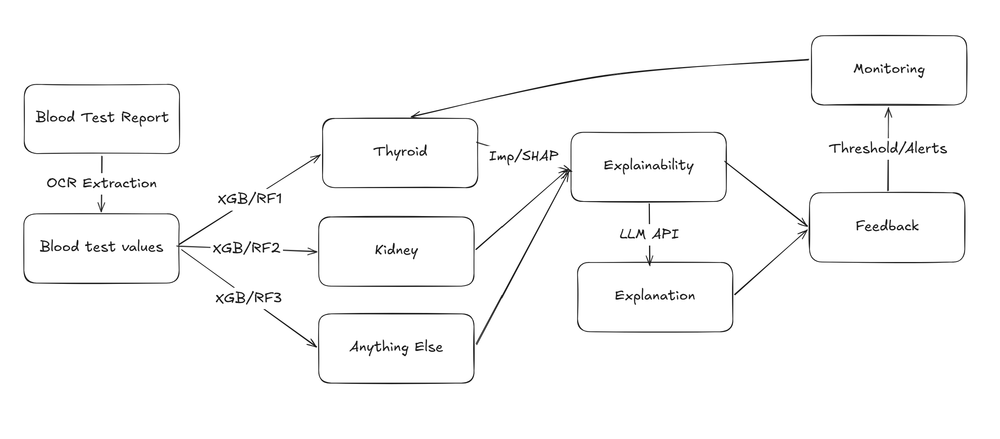

# VitaDoc: High Level Design Document

## 1. Problem Statement

Blood test reports are routinely generated but rarely understood by patients.
Clinicians are overloaded and patients often receive no explanation of their
results. VitaDoc addresses this by automatically extracting lab values from
a blood test PDF and classifying health status across two clinically
significant conditions Chronic Kidney Disease (CKD) and thyroid dysfunction, providing plain-English explanations powered by a large language model.

---

## 2. Success Metrics

### ML Metrics
| Model   | Metric   | Target | Achieved |
|---------|----------|--------|----------|
| CKD     | AUC-ROC  | ≥ 0.95 | ✅ |
| Thyroid | Macro-F1 | ≥ 0.50 | ✅ |

### Business Metrics
| Metric                    | Target    |
|---------------------------|-----------|
| End-to-end response time  | < 2s      |
| Model inference latency   | < 200ms   |
| PDF OCR extraction rate   | > 40%     |
| System uptime             | > 99%     |

### Throughput Targets (Inference + Pipeline)

| Layer | Metric | Target | How Measured |
|---|---|---|---|
| Backend API | Single-request latency | < 2s | `/analyse` and `/analyse/manual` timed in smoke tests |
| Backend API | Sustained throughput | >= 20 requests/min on local setup | Count of successful analyses per minute from `vitadoc_requests_total` |
| OCR + Inference | Per-request processing time | < 1.5s median | Prometheus histogram `vitadoc_inference_seconds` |
| Data Pipeline (Airflow + DVC) | Weekly DAG completion | < 5 min | Airflow run logs + task timestamps |
| Retraining DAG | Nightly decision + run | < 10 min (when triggered) | Airflow run logs |

---

## 3. Design Paradigm

VitaDoc follows the **functional paradigm** throughout.

All modules are organised as collections of pure functions with explicit
inputs and outputs. There are no classes with mutable state in the data
pipeline or backend  state is passed explicitly between functions rather
than stored in object instances. This makes every stage independently
testable, reproducible, and easy to reason about.

The only exceptions are:
- Pydantic models in the backend (data validation schemas, not business logic)
- SQLite connection objects (standard library, unavoidable)
- Prometheus metrics (global counters, required by the library)

---

## 4. Architecture Overview

### 4.1 Final System Architecture


This architecture shows the production-facing block design used in VitaDoc:
- **User Browser + Frontend (nginx, :8501):** static UI for PDF upload,
  manual entry, results, and monitoring links.
- **FastAPI Backend (:8000):** single inference gateway exposing REST APIs
  (`/analyse`, `/analyse/manual`, `/feedback`, `/stats`, `/metrics`).
- **Backend internal modules:** OCR extraction (`pdfplumber`), model
  inference pipeline, and explanation generation via Groq LLM API.
- **Persistence + registry:** SQLite stores predictions/feedback; MLflow
  tracks experiments and serves model registry metadata/artifacts.
- **MLOps layer:** Airflow orchestrates weekly data pipeline and nightly
  retraining checks; DVC runs reproducible data/model stages.
- **Observability:** Prometheus scrapes backend metrics, Alertmanager handles, rules, Grafana visualizes live dashboards and alerts.

### 4.2 Architecture Evolution (Rough to Final)



The rough architecture captured the conceptual flow:
- Report → OCR extraction → structured blood values
- Values routed to condition models (thyroid/kidney)
- Explainability + LLM-generated explanation
- Feedback loop + threshold-based monitoring

The final architecture operationalizes that concept with explicit, deployable
components (FastAPI, Airflow, DVC, MLflow, Prometheus, Grafana) and clear service boundaries required by the rubric.

### 4.3 Rubric Alignment Notes

- **Loose coupling:** frontend and backend are independent services connected
  only through configurable REST APIs.
- **Scalability path:** stateless API handling enables horizontal backend
  replication; batch mode can be added via fan-out or `/analyse/batch`.
- **Monitoring and maintenance:** metrics, drift indicators, alerts, and
  feedback-driven retraining are built into the architecture.


---

## 5. Component Responsibilities

### Frontend (`frontend/index.html`)
- Static HTML/CSS/JS application served by nginx
- Provides PDF upload, manual lab value entry, results display
- **Contains zero ML logic**, all inference happens in the backend
- Communicates with backend exclusively via REST API calls
- Backend URL is configurable via `BACKEND_URL` environment variable
- This enforces loose coupling, frontend can be replaced without
  touching the backend

### Backend (`backend/main.py`)
- FastAPI application, the only component that touches models
- Responsibilities: OCR extraction, feature engineering at inference
  time, model inference, Groq explanation, SQLite persistence,
  Prometheus metric emission
- Loads models from local pickle files at startup, falls back to
  MLflow registry if pickle not found
- Exposes `/health` and `/ready` for Docker orchestration

### MLflow (`:5000`)
- Tracks every training experiment, parameters, metrics, artifacts
- Hosts the Model Registry, Production stage models are what the
  backend loads
- Experiment comparison UI for XGBoost vs Random Forest runs

### Apache Airflow (`:8080`)
- `vitadoc_data_pipeline` DAG: weekly data engineering
  (download → validate → preprocess → engineer → baselines → EDA)
- `vitadoc_retraining` DAG  nightly at 2am, checks drift and
  feedback, triggers `dvc repro` if threshold exceeded
- Uses `vitadoc_pool` (3 slots) for parallel task management 
  preprocess_ckd and preprocess_thyroid run in parallel

### DVC Pipeline
- Defines the full reproducible pipeline in `dvc.yaml`
- Tracks data file hashes only re-runs stages whose inputs changed
- Every experiment reproducible via git commit hash + MLflow run ID
- `dvc repro` is called by the retraining DAG automatically

### Prometheus + Grafana + Alertmanager
- Prometheus scrapes `/metrics` from the backend every 15s
- Custom metrics: prediction counts, inference latency, feature drift,
  OCR coverage, model version, feedback counts
- Grafana dashboard shows all metrics in near-real-time
- Alertmanager fires alerts when drift > 2σ or error rate > 5%

---

## 6. Data Flow

### PDF Upload Path
```
User uploads PDF
    → nginx forwards to backend /analyse
    → pdfplumber extracts text
    → SYNONYM_MAP maps text to canonical feature names
    → Engineered features computed (kidney_stress, tsh_t3_ratio)
    → Features routed to CKD model if coverage ≥ 40%
    → Features routed to Thyroid model if coverage ≥ 40%
    → Groq API generates plain-English explanation
    → Prediction saved to SQLite (for retraining loop)
    → Prometheus metrics updated
    → AnalysisResult JSON returned to frontend
    → Frontend renders result cards
```

### Feedback / Retraining Loop
```
User submits correction via frontend
    → POST /feedback → SQLite feedback table
    → Nightly at 2am: Airflow retraining DAG runs
    → check_drift reads last 200 predictions, computes rolling means
    → check_feedback counts unused corrections, computes correction rate
    → If drift > 2σ OR (corrections ≥ 20 AND rate > 15%):
        → Feedback rows appended to raw CSVs
        → dvc repro runs only affected stages re-execute
        → New model version registered in MLflow
```

---

## 7. Data Sources

| Dataset  | Source                | Features | License     |
|----------|-----------------------|----------|-------------|
| CKD      | UCI ML Repo ID 336    | 25       | CC BY 4.0   |
| Thyroid  | UCI ML Repo ID 102    | 28       | CC BY 4.0   |

Both datasets are public, anonymised, and contain no PII.
No encryption at rest is required. All API communication uses
HTTPS in production (enforced via nginx TLS termination).

---

## 8. Technology Stack

| Layer           | Technology                    | Purpose                        |
|-----------------|-------------------------------|--------------------------------|
| Frontend        | HTML/CSS/JS + nginx           | User interface                 |
| Backend API     | FastAPI + Python 3.10         | Inference and orchestration    |
| ML Models       | XGBoost + Random Forest       | CKD and thyroid classification |
| Feature Eng.    | scikit-learn Pipeline         | Preprocessing and inference    |
| Experiment Track| MLflow 2.11                   | Metrics, params, model registry|
| Data Pipeline   | DVC + Apache Airflow 2.8      | Reproducible pipeline + scheduling |
| Monitoring      | Prometheus + Grafana + Alertmanager | Drift and latency monitoring |
| Explanations    | Groq API (Llama 3)            | Plain-English summaries        |
| Persistence     | SQLite                        | Predictions and feedback log   |
| Containerisation| Docker + Docker Compose       | Environment parity             |
| CI              | GitHub Actions                | Automated testing on push      |
| Version Control | Git + DVC                     | Code and data versioning       |

---

## 9. Loose Coupling: Frontend / Backend Separation

The rubric explicitly requires strict loose coupling between the
frontend and backend. VitaDoc enforces this as follows:

- The frontend is a static HTML file with no Python dependencies
- The frontend never imports or calls any ML library directly
- All communication is via REST API calls to a configurable URL
- `BACKEND_URL` is configured via environment variable at deployment/runtime
  (Docker Compose), satisfying the rubric requirement for configurable REST
  integration between independent frontend and backend blocks
- The backend can be restarted, redeployed, or replaced without
  any change to the frontend
- The frontend can be replaced with a different framework (React,
  Vue, Streamlit) without any change to the backend
- They run as two separate Docker containers in docker-compose.yml

---

## 10. Security

- API keys (GROQ_API_KEY, Mailtrap) stored in `.env`, never committed
- `.env` is in `.gitignore`
- Docker Compose reads secrets from environment variables only
- Datasets are public UCI data no PII, no encryption required at rest
- HTTPS enforced in production via nginx (configurable)

### Data-at-Rest Controls

- VitaDoc is designed to minimize stored personal data.
- `name` and direct patient identifiers are **not persisted** in prediction logs.
- `age` and `sex` may be used for inference, but stored records are limited to model-relevant fields and feedback labels.
- Persistent volumes (SQLite DB, MLflow artifacts, logs) must be hosted on encrypted disk in deployment environments (for example, LUKS/dm-crypt on Linux or cloud-managed encrypted volumes).
- Backup artifacts must be encrypted before off-host transfer.
- Access to stored artifacts is restricted to project operators.


---

## 11. Environment Parity

All services run identically in development, testing, and production
via Docker Compose. The `conda.yaml` and `MLproject` files ensure
training environments are reproducible. Every experiment is
reproducible via:

```bash
git checkout <commit_hash>
dvc checkout
mlflow runs get --run-id <mlflow_run_id>
```

---

## 12. Scalability and Batch Strategy

- **Horizontal API scaling:** Backend is request-stateless for inference, so it
  can be replicated behind a reverse proxy/load balancer.
- **Current file processing mode:** one-PDF-per-request on `/analyse`.
- **General batch support path:** run parallel `/analyse` requests from scripts
  or services (client fan-out), even without UI changes.
- **Planned native batch endpoint:** add `/analyse/batch` with `files[]` input
  and per-file output for partial success/failure handling.
- **Scale safeguards:** request-size caps, bounded worker concurrency,
  Prometheus throughput/error monitoring.
- **Persistence roadmap:** SQLite for demo-scale simplicity, PostgreSQL for
  higher write concurrency and multi-replica production workloads.

---

## 13. User Documentation

- Non-technical user manual: `docs/user_manual.md`
- Technical design docs: `docs/hld.md`, `docs/lld.md`
- Test planning and traceability: `docs/test_plan.md`

---
